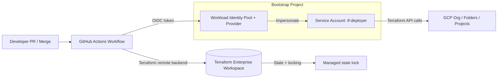

# GCP Landing Zone Bootstrap (FAST/Fabric style)

This repository bootstraps the first 4 items needed to run enterprise Terraform from GitHub Actions using OIDC on Google Cloud:

1. Prerequisites and platform setup
2. OIDC federation from GitHub Actions to Google Cloud
3. Terraform deployer service account and required role bindings
4. Enterprise Terraform code sources (Fabric + FAST references)

## Architecture (OIDC + Terraform Bootstrap)



## 1) Prerequisites

- Google account with admin access to your target Google Cloud Organization
- GCP Organization ID
- Billing account ID
- Bootstrap project ID (where WIF + deployer SA will live)
- GitHub organization/repo and branch name for deployment
- Terraform Enterprise/Cloud organization and workspace
- Terraform API token (`TF_API_TOKEN`) for GitHub Actions

### Create Google Cloud account and organization (first time)

1. Create or sign in to a Google account.
2. Go to [Google Cloud Console](https://console.cloud.google.com/) and activate billing.
3. If you do not already have one, create a Google Cloud Organization (typically via Google Workspace/Cloud Identity domain setup).
4. In the Organization, create a billing account and note `billing_account_id`.
5. Create one bootstrap project and note `bootstrap_project_id`.
6. Make sure your admin user can:
   - enable APIs in bootstrap project
   - create service accounts and IAM bindings
   - create Workload Identity Pool and Provider

Enable APIs in bootstrap project:

- `iam.googleapis.com`
- `cloudresourcemanager.googleapis.com`
- `sts.googleapis.com`
- `iamcredentials.googleapis.com`
- `serviceusage.googleapis.com`

### Who should run bootstrap apply

Run the first `terraform apply` using a trusted admin identity (human admin or privileged automation account) that already has enough permissions in the bootstrap project/org. This bootstrap apply creates the deployer service account and OIDC trust.

## 2) Terraform Enterprise IDs and where they are used

Terraform Enterprise/Cloud backend fields:

- `hostname` -> your TFE hostname (for example `app.terraform.io` or private TFE hostname)
- `organization` -> your TFE organization name
- `workspaces:name` -> workspace name that stores this stack state and locking

Where these IDs are used:

- Local init:
  - `terraform init -backend-config="hostname=..." -backend-config="organization=..." -backend-config="workspaces:name=..."`
- GitHub Actions init:
  - `.github/workflows/terraform-bootstrap.yml` reads `TFE_HOSTNAME`, `TFE_ORGANIZATION`, `TFE_WORKSPACE`
- Auth to TFE:
  - `TF_API_TOKEN` secret is used by Terraform CLI in CI to talk to TFE

## 3) OIDC federation from GitHub Actions

This repo creates:

- Workload Identity Pool
- Workload Identity Provider for GitHub (`https://token.actions.githubusercontent.com`)
- Attribute mapping and condition locked to a single repo + branch
- Binding that allows that GitHub principal to impersonate the Terraform deployer service account

### How OIDC is enabled (exact flow)

1. GitHub Actions requests an OIDC token from `token.actions.githubusercontent.com`.
2. Google Workload Identity Provider validates the token issuer and claims.
3. Attribute condition enforces repository and branch match (`repo` + `ref`).
4. If condition passes, GitHub principal can impersonate `tf-deployer` service account using `roles/iam.workloadIdentityUser`.
5. Terraform runs in CI as that service account identity (no key file).

## 4) Terraform deployer service account + role bindings

This repo creates `tf-deployer` in the bootstrap project and binds bootstrap-level roles needed for initial enterprise Terraform execution. Extend scope/least privilege as you move to org/folder/project-level modules.

### Is a service account required?

Yes, recommended. For GitHub OIDC to run Terraform safely in GCP, use a dedicated service account (created by this bootstrap) and allow only trusted GitHub principals to impersonate it. Avoid static service account keys.

### Who assigns roles to this service account?

The identity running the first bootstrap apply assigns roles. In enterprise setups, this is usually a platform admin group or break-glass automation identity.

### Minimum role strategy

- Start with only roles required for bootstrap resources.
- Add folder/org/project roles only when a module needs them.
- Prefer narrow scope (project/folder) over org-wide scope whenever possible.

## 5) Enterprise code sources

Use these official references as upstream module and blueprint sources:

- Fabric modules: <https://github.com/GoogleCloudPlatform/cloud-foundation-fabric>
- FAST blueprints: <https://github.com/GoogleCloudPlatform/cloud-foundation-fabric-fast>

## How to use

## Initial deployment prerequisites and full steps

Follow this in order for first deployment.

### Step 0: Collect required IDs and values

Prepare these values before running Terraform:

- `organization_id` (numeric, example `123456789012`)
- `billing_account_id` (format `XXXXXX-XXXXXX-XXXXXX`)
- `bootstrap_project_id` (project that will host WIF + deployer SA)
- `github_org` and `github_repo`
- deployment branch ref (for example `refs/heads/main`)
- `wif_pool_id` and `wif_provider_id` names
- deployer SA id (default `tf-deployer`)
- `tfe_hostname` (example `app.terraform.io`)
- `tfe_organization`
- `tfe_workspace`

### Step 1: Prepare Google Cloud account and org

1. Sign in to Google Cloud with an admin user.
2. Ensure Organization exists and you can view its ID.
3. Ensure Billing account exists and is active.
4. Create bootstrap project (or choose an existing one).
5. Link bootstrap project to billing account.
6. Ensure admin identity has permission to:
   - enable project services
   - create service accounts and IAM bindings
   - create Workload Identity Pool and Provider

### Step 2: Enable required APIs in bootstrap project

Enable:

- `iam.googleapis.com`
- `cloudresourcemanager.googleapis.com`
- `sts.googleapis.com`
- `iamcredentials.googleapis.com`
- `serviceusage.googleapis.com`

### Step 3: Prepare Terraform Enterprise workspace and token

1. Create/select TFE organization.
2. Create/select workspace for bootstrap state.
3. Create user/team API token with permission to run Terraform in that workspace.
4. Keep token ready for:
   - local shell as `TF_TOKEN_app_terraform_io` (or matching private hostname pattern)
   - GitHub secret `TF_API_TOKEN`

### Step 4: Configure Terraform input variables

```bash
cd terraform/bootstrap
cp terraform.tfvars.example terraform.tfvars
```

Edit `terraform.tfvars` with your real values.

### Step 5: Initialize and run first bootstrap apply (admin identity)

```bash
cd terraform/bootstrap
terraform init \
  -backend-config="hostname=<tfe-hostname>" \
  -backend-config="organization=<tfe-organization>" \
  -backend-config="workspaces:name=<tfe-workspace>"
terraform plan
terraform apply
```

This creates:

- GitHub Workload Identity Pool + Provider
- Terraform deployer service account
- IAM binding for GitHub OIDC principal to impersonate service account

### Step 6: Capture Terraform outputs

After apply, copy output values for:

- `workload_identity_provider`
- `terraform_service_account_email`

### Step 7: Configure GitHub repository secrets/variables

Set these in your GitHub repo:

- Secret: `GCP_WORKLOAD_IDENTITY_PROVIDER` = output `workload_identity_provider`
- Secret: `GCP_TERRAFORM_SERVICE_ACCOUNT` = output `terraform_service_account_email`
- Secret: `TF_API_TOKEN` = Terraform Enterprise API token
- Variable: `TFE_HOSTNAME` = Terraform Enterprise hostname
- Variable: `TFE_ORGANIZATION` = Terraform Enterprise organization
- Variable: `TFE_WORKSPACE` = Terraform Enterprise workspace

### Step 8: Validate OIDC CI deployment

1. Open PR touching `terraform/bootstrap/**` to trigger `plan`.
2. Merge to `main` to trigger `apply`.
3. Confirm GitHub job uses OIDC auth (no service account key files).
4. Confirm state and locking are in Terraform Enterprise workspace.

### A. Configure variables

Copy `terraform/bootstrap/terraform.tfvars.example` to `terraform/bootstrap/terraform.tfvars` and set values.

### B. Configure Terraform Enterprise backend and bootstrap (first run)

```bash
cd terraform/bootstrap
terraform init \
  -backend-config="hostname=app.terraform.io" \
  -backend-config="organization=<tfe-org>" \
  -backend-config="workspaces=name=<tfe-workspace>"
terraform plan
terraform apply
```

After apply, capture outputs and add these GitHub repo secrets/variables:

- `GCP_WORKLOAD_IDENTITY_PROVIDER`
- `GCP_TERRAFORM_SERVICE_ACCOUNT`
- `TF_API_TOKEN` (GitHub secret)
- `TFE_HOSTNAME` (GitHub variable, for example `app.terraform.io`)
- `TFE_ORGANIZATION` (GitHub variable)
- `TFE_WORKSPACE` (GitHub variable)

### C. Run from GitHub Actions via OIDC

Push to `main` (or open PR to run plan).

Workflow path: `.github/workflows/terraform-bootstrap.yml`

## Deny-by-default model

Apply these controls so deployment access is deny-by-default:

1. Do not create service account keys.
2. Allow impersonation only from a specific GitHub repo and branch (already enforced by provider condition and principalSet binding).
3. Use dedicated deployer service account, not broad human admin identities in CI.
4. Use least-privilege IAM roles and scoped bindings.
5. Protect `main` branch and require PR review/status checks.
6. Store only required secrets (`TF_API_TOKEN`, provider and SA identifiers) in GitHub.

If you need stricter controls, extend the attribute condition to include additional claims (for example environment/reusable workflow restrictions) and separate prod/non-prod workspaces and service accounts.

## Notes

- This is the bootstrap layer only (items 1-4).
- Next layer typically adds org/folder/project/network/security modules from FAST/Fabric.
