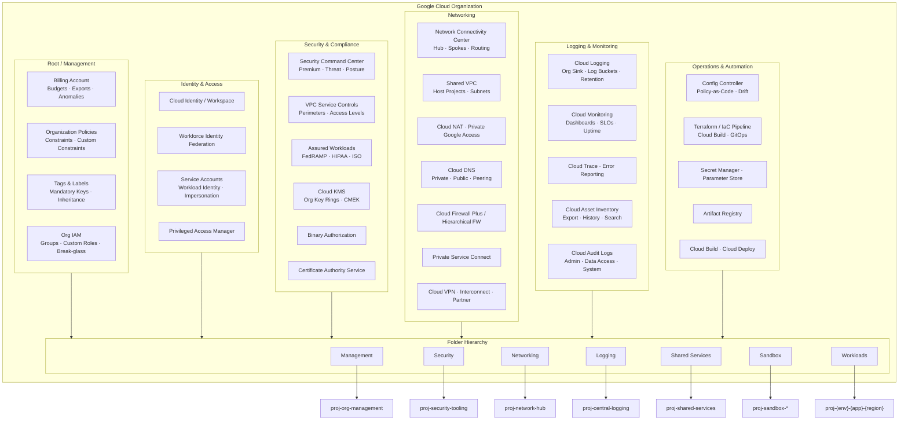
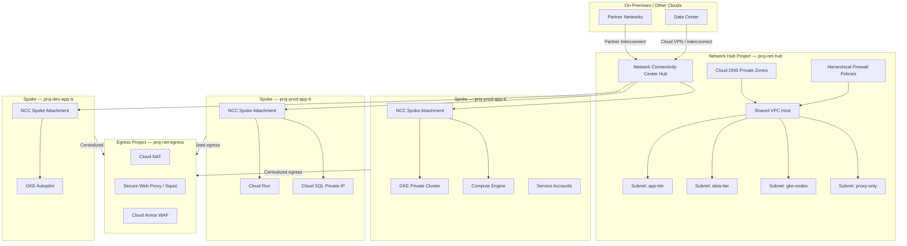
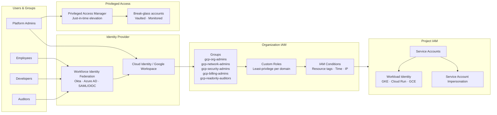
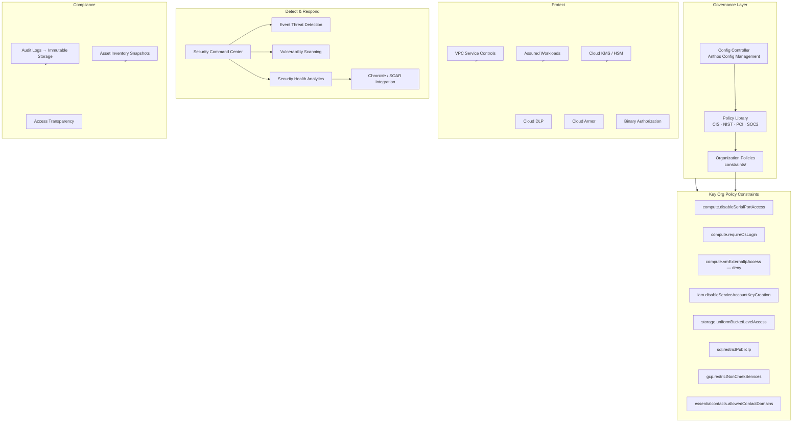
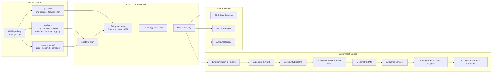

# GCP Landing Zone (LZA-style)

Enterprise GCP Landing Zone modeled after [AWS Landing Zone Accelerator (LZA)](https://aws.amazon.com/solutions/implementations/landing-zone-accelerator-on-aws/) — opinionated, multi-account (multi-project) foundation with guardrails, shared services, and repeatable workload onboarding.

---

## High-Level Architecture



---

## Organization & Folder Structure

Mirrors AWS LZA OU layout: dedicated folders for management, security, networking, logging, shared services, sandbox, and workloads.

```mermaid
flowchart TD
    ORG["Organization<br/>example.com"]

    ORG --> F_ROOT["Root Management Folder"]
    ORG --> F_MGMT["Management"]
    ORG --> F_SEC["Security"]
    ORG --> F_INFRA["Infrastructure"]
    ORG --> F_SANDBOX["Sandbox"]
    ORG --> F_SUSP["Suspended"]
    ORG --> F_WL["Workloads"]

    F_MGMT --> P_BILL["proj-billing-admin"]
    F_MGMT --> P_ORG["proj-org-admin"]
    F_MGMT --> P_IAM["proj-identity-admin"]

    F_SEC --> P_SCC["proj-scc-admin"]
    F_SEC --> P_KMS["proj-kms-admin"]
    F_SEC --> P_SECOPS["proj-secops"]

    F_INFRA --> F_NET["Networking"]
    F_INFRA --> F_LOG["Logging & Audit"]
    F_INFRA --> F_SHARED["Shared Services"]

    F_NET --> P_NET_HUB["proj-net-hub"]
    F_NET --> P_NET_EGRESS["proj-net-egress"]
    F_NET --> P_DNS["proj-dns-admin"]

    F_LOG --> P_LOG["proj-log-archive"]
    F_LOG --> P_AUDIT["proj-audit-logs"]
    F_LOG --> P_MON["proj-monitoring"]

    F_SHARED --> P_ART["proj-artifact-registry"]
    F_SHARED --> P_CI["proj-cicd-shared"]
    F_SHARED --> P_SM["proj-secrets-shared"]

    F_SANDBOX --> P_SB1["proj-sandbox-dev-01"]
    F_SANDBOX --> P_SB2["proj-sandbox-dev-02"]

    F_SUSP --> P_SUSP["proj-suspended-*"]

    F_WL --> F_PROD["Production"]
    F_WL --> F_NONPROD["Non-Production"]

    F_PROD --> P_PROD1["proj-prod-app-a"]
    F_PROD --> P_PROD2["proj-prod-app-b"]

    F_NONPROD --> P_DEV["proj-dev-app-a"]
    F_NONPROD --> P_STG["proj-stg-app-a"]
    F_NONPROD --> P_QA["proj-qa-app-a"]
```



---

## Networking Topology (Hub-and-Spoke)

Equivalent to AWS LZA network accounts + Transit Gateway + centralized egress.



---

## Identity & Access Management

Maps to AWS IAM Identity Center + cross-account roles.



---

## Security & Governance Guardrails

Equivalent to AWS SCPs, Config rules, GuardDuty, Security Hub.



---

## Centralized Logging & Monitoring

Maps to AWS Log Archive account + CloudTrail org trail + centralized metrics.

```mermaid
flowchart LR
    subgraph SOURCES["All Projects & Folders"]
        P1["Workload Projects"]
        P2["Shared VPC Host"]
        P3["Security Tooling"]
        P4["Management"]
    end

    subgraph COLLECT["Collection"]
        AUDIT["Cloud Audit Logs<br/>Admin · Data · System"]
        APP["Application Logs"]
        FW["VPC Flow Logs"]
        DNS_L["DNS Query Logs"]
        LB["Load Balancer Logs"]
        GKE_L["GKE Audit & Container Logs"]
    end

    subgraph ROUTE["Routing — Org Log Sinks"]
        SINK1["Sink → Log Archive Bucket"]
        SINK2["Sink → BigQuery Analytics"]
        SINK3["Sink → Pub/Sub → SIEM"]
        SINK4["Sink → Chronicle"]
    end

    subgraph ARCHIVE["Log Archive Project"]
        GCS["GCS Buckets<br/>Locked · Retention · CMEK"]
        BQ["BigQuery Datasets<br/>Log Analytics"]
        CHRON["Chronicle / SecOps"]
    end

    subgraph MONITOR["Monitoring Project"]
        DASH["Dashboards"]
        ALERT["Alerting Policies"]
        SLO["SLO / SLI"]
        UPTIME["Uptime Checks"]
        TRACE["Trace & Error Reporting"]
    end

    P1 & P2 & P3 & P4 --> COLLECT
    COLLECT --> ROUTE
    ROUTE --> ARCHIVE
    COLLECT --> MONITOR
```



---

## Deployment & Customizations Pipeline

Maps to AWS LZA pipeline + customization stages.



---

## Component Reference — AWS LZA vs GCP Landing Zone

| AWS LZA Component | GCP Landing Zone Equivalent |
|---|---|
| AWS Organizations | Google Cloud Organization |
| Organizational Units (OUs) | Folders |
| AWS Accounts | Projects |
| Service Control Policies (SCPs) | Organization Policies + Custom Constraints |
| Control Tower | Config Controller + Policy Controller |
| IAM Identity Center | Cloud Identity + Workforce Identity Federation |
| Cross-account IAM roles | Service Account Impersonation + Workload Identity |
| Transit Gateway | Network Connectivity Center (NCC) |
| Shared VPC (concept) | Shared VPC (host + service projects) |
| Network Firewall / NFW | Hierarchical Firewall Policies + Cloud Firewall Plus |
| Centralized egress VPC | Dedicated egress project + Cloud NAT + Secure Web Proxy |
| Route 53 | Cloud DNS |
| CloudTrail (org trail) | Cloud Audit Logs + Org Log Sinks |
| Log Archive account | Log Archive project (GCS + BigQuery) |
| AWS Config | Cloud Asset Inventory + Config Controller |
| GuardDuty / Security Hub | Security Command Center Premium |
| KMS | Cloud KMS + Cloud HSM |
| Secrets Manager | Secret Manager |
| CodePipeline / CodeBuild | Cloud Build + Cloud Deploy |
| Service Catalog | Private Catalog / Internal Terraform modules |
| Resource Groups / Tag Policies | Labels + Tags + Org Policy on labels |
| Budgets | Billing budgets + anomaly detection |
| Backup | Backup for GCE / GKE / Cloud SQL |
| WAF | Cloud Armor |
| PrivateLink | Private Service Connect |
| Direct Connect | Cloud Interconnect |
| Site-to-Site VPN | Cloud HA VPN |
| Landing Zone Accelerator pipeline | Terraform / IaC pipeline (Cloud Build) |

---

## Recommended Project Inventory

| Project ID Pattern | Folder | Purpose |
|---|---|---|
| `proj-org-admin` | Management | Org-level admin, org policies |
| `proj-billing-admin` | Management | Billing export, budgets, FinOps |
| `proj-identity-admin` | Management | Cloud Identity groups sync, WIF |
| `proj-scc-admin` | Security | SCC, posture, threat detection |
| `proj-kms-admin` | Security | Org-wide KMS key rings |
| `proj-secops` | Security | Chronicle, SOAR, incident response |
| `proj-net-hub` | Networking | NCC hub, Shared VPC host |
| `proj-net-egress` | Networking | Centralized NAT, proxy, WAF |
| `proj-dns-admin` | Networking | Public/private DNS zones |
| `proj-log-archive` | Logging | Immutable log storage (GCS) |
| `proj-audit-logs` | Logging | Audit log sinks, BigQuery |
| `proj-monitoring` | Logging | Dashboards, alerts, SLOs |
| `proj-artifact-registry` | Shared Services | Container images, artifacts |
| `proj-cicd-shared` | Shared Services | Cloud Build, deploy pipelines |
| `proj-secrets-shared` | Shared Services | Shared secrets (bootstrap) |
| `proj-sandbox-*` | Sandbox | Experimentation (relaxed policies) |
| `proj-{env}-{app}-{region}` | Workloads | Application workloads |

---

## Deployment Order (Bootstrap Sequence)

1. **Create Organization** — Link billing, verify domain, enable required APIs
2. **Management folder & projects** — org-admin, billing-admin
3. **Org policies (baseline deny)** — disable SA keys, no public IPs, OS Login
4. **Logging project & org sinks** — audit logs before anything else
5. **Security project** — SCC, KMS, VPC-SC perimeter design
6. **Network hub** — Shared VPC, NCC hub, hierarchical firewall
7. **Identity** — groups, custom roles, WIF pools, break-glass
8. **Shared services** — Artifact Registry, CI/CD, Secret Manager
9. **Sandbox & workload folders** — project factory / Terraform modules
10. **Customizations** — per-business-unit overrides via policy exceptions

---

## Repository Structure

```
GCP-LandingZone/
├── configs/                    # LZA-style YAML (edit before deploy)
│   ├── global-config.yaml      # Org ID, billing, regions
│   ├── folders-config.yaml     # Folder hierarchy (OUs)
│   ├── projects-config.yaml    # Platform projects (accounts)
│   ├── workloads-config.yaml   # Workload project factory
│   ├── security-config.yaml    # Org policies, KMS, log sinks
│   ├── network-config.yaml     # Shared VPC, NAT, DNS
│   └── iam-config.yaml         # Groups, roles, service accounts
├── stages/                     # Staged Terraform deployment
│   ├── 0-org-setup/            # Folders, projects, IAM
│   ├── 1-security/             # Org policies, KMS, logging
│   ├── 2-networking/           # Shared VPC, egress, DNS
│   ├── 3-project-factory/      # Workload vending
│   └── 4-cicd/                 # WIF, Cloud Build
├── modules/                    # Reusable Terraform modules
├── cloudbuild/                 # CI/CD pipeline YAML
├── scripts/bootstrap.sh        # Deploy script
├── Makefile
└── docs/
    ├── architecture.md
    └── DEPLOYMENT.md           # Step-by-step deploy guide
```

## Quick Start

1. Edit `configs/global-config.yaml` with your org ID and billing account
2. Create bootstrap project: `gcloud projects create proj-bootstrap`
3. Deploy: `./scripts/bootstrap.sh all`

See [docs/DEPLOYMENT.md](docs/DEPLOYMENT.md) for full bootstrap instructions.

## Full Deployment Steps

Use this sequence for first-time deployment.

### 1) Prerequisites

- Install `gcloud` and `terraform >= 1.5`
- Authenticate:

```bash
gcloud auth login
gcloud auth application-default login
```

- Ensure your user has organization-level permissions (org admin + billing admin)

### 2) Update configuration

Edit these files before deploying:

- `configs/global-config.yaml`
  - `organization.id`
  - `billing.account_id`
  - domain/customer values
- `configs/iam-config.yaml`
  - real group emails
- `configs/projects-config.yaml`
  - adjust project IDs if any are already used globally

### 3) Create bootstrap project manually

```bash
gcloud projects create proj-bootstrap --name="Bootstrap"
gcloud billing projects link proj-bootstrap --billing-account=YOUR_BILLING_ID
gcloud services enable cloudresourcemanager.googleapis.com serviceusage.googleapis.com \
  storage.googleapis.com cloudbilling.googleapis.com orgpolicy.googleapis.com \
  --project=proj-bootstrap
```

### 4) Deploy stage 0 first (local backend for bootstrap)

```bash
cp stages/0-org-setup/backend.local.tf.example stages/0-org-setup/backend_override.tf
cp stages/0-org-setup/terraform.tfvars.example stages/0-org-setup/terraform.tfvars
```

Edit `stages/0-org-setup/terraform.tfvars`:

```hcl
bootstrap_project_id = "proj-bootstrap"
config_path          = "../../configs"
```

Run stage 0:

```bash
cd stages/0-org-setup
terraform init
terraform plan
terraform apply
```

### 5) Migrate state to GCS backend

```bash
rm backend_override.tf
terraform init -migrate-state
cd ../..
```

### 6) Deploy remaining stages in order

Plan first:

```bash
./scripts/bootstrap.sh --plan-only 1-security
./scripts/bootstrap.sh --plan-only 2-networking
./scripts/bootstrap.sh --plan-only 3-project-factory
./scripts/bootstrap.sh --plan-only 4-cicd
```

Apply:

```bash
./scripts/bootstrap.sh 1-security
./scripts/bootstrap.sh 2-networking
./scripts/bootstrap.sh 3-project-factory
./scripts/bootstrap.sh 4-cicd
```

## Pre-Deploy Fixes Required

Current code has a few blockers to resolve before production deployment:

- Stage 0 assumes every IAM group has `org_roles`
- Stage 2 attaches workload service projects before stage 3 creates them
- Stage 1 BigQuery IAM uses `proj-audit-logs` while dataset is created in `proj-log-archive`
- `cloudbuild/cloudbuild-plan.yaml` and `cloudbuild/cloudbuild-apply.yaml` use invalid step `name` values (must be container image names)

## How Cloud Build Starts

Cloud Build in this repo is triggered by GitHub events after stage 4 creates the triggers.

1. Deploy stage 4: `./scripts/bootstrap.sh 4-cicd`
2. Stage 4 creates Cloud Build triggers in `proj-cicd-shared`
3. GitHub events start builds:
   - Pull request to `main` or `develop` -> `cloudbuild/cloudbuild-plan.yaml`
   - Push to `main` -> `cloudbuild/cloudbuild-apply.yaml`

Trigger definitions are in `stages/4-cicd/main.tf`.

Manual run examples:

```bash
gcloud builds submit --config=cloudbuild/cloudbuild-plan.yaml --substitutions=_STAGE=0-org-setup .
gcloud builds submit --config=cloudbuild/cloudbuild-apply.yaml --substitutions=_STAGE=0-org-setup .
```

## What To Do Next

After code is ready, follow this operational sequence:

1. Fix all items in `Pre-Deploy Fixes Required`
2. Validate code:

```bash
make fmt
make validate
```

3. Deploy by stages:

```bash
./scripts/bootstrap.sh 0-org-setup
./scripts/bootstrap.sh 1-security
./scripts/bootstrap.sh 2-networking
./scripts/bootstrap.sh 3-project-factory
./scripts/bootstrap.sh 4-cicd
```

4. Verify in GCP:
   - Folder hierarchy created
   - Platform and workload projects created
   - Org policies enforced
   - Shared VPC and subnets attached
   - Cloud Build triggers present in `proj-cicd-shared`

5. Create PR after successful validation/deploy test:

```bash
git checkout -b feat/gcp-landing-zone-lza
git add .
git commit -m "Add LZA-style GCP landing zone with staged Terraform and deployment docs"
git push -u origin feat/gcp-landing-zone-lza
```

Then open a pull request and include:
- what was implemented (`configs`, `stages`, `modules`, `cloudbuild`, docs)
- what was validated (`make validate`, stage plans/applies)
- any remaining known limitations

---

## Legacy Suggested Structure
# GCP-LandingZone
