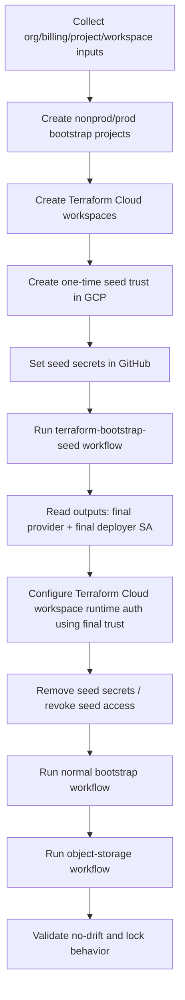

# GCP Landing Zone Runbook (Seed OIDC -> Terraform Cloud Remote)

This runbook is a strict, step-by-step setup for this repository.

It covers:

- how to create nonprod/prod foundations
- how to bootstrap OIDC trust with a one-time seed pipeline
- how to run normal deployments with Terraform Cloud remote execution
- where each credential is used

---

## 1) What this repository does

- `terraform/bootstrap/`
  - creates trust and identity resources in GCP:
    - Workload Identity Pool
    - Workload Identity Provider
    - Terraform deployer service account
    - IAM bindings/roles
    - required APIs

- `terraform/object-storage/`
  - creates one sample resource:
    - GCS bucket

- Workflows:
  - `.github/workflows/terraform-bootstrap-seed.yml` (one-time seed run)
  - `.github/workflows/terraform-bootstrap.yml` (normal bootstrap updates)
  - `.github/workflows/terraform-object-storage.yml` (normal resource deployment)

---

## 2) Execution model used here

This repo is configured for **Terraform Cloud Remote execution** for normal runs.

That means:

- GitHub Actions triggers Terraform
- Terraform Cloud workers execute plan/apply
- Terraform Cloud stores state and lock
- GCP provider credentials must be available in Terraform Cloud workspace runtime

Important:
- normal workflows do **not** use runner-side `google-github-actions/auth`
- seed workflow uses temporary seed OIDC to create final trust resources

---

## 3) High-level flow (single source of truth)



---

## 4) Environment strategy

Use strict split:

- `develop` -> nonprod
- `main` -> prod

Recommended naming:

- Projects:
  - `lz-bootstrap-nonprod-<suffix>`
  - `lz-bootstrap-prod-<suffix>`
- Terraform Cloud workspaces:
  - `bootstrap-nonprod`
  - `bootstrap-prod`
  - `object-storage-nonprod`
  - `object-storage-prod`

---

## 5) Prerequisites and how to collect IDs

## 5.1 Required prerequisites

- Google Cloud Organization exists
- Billing account exists
- Terraform Cloud org exists (example: `vaflt-org`)
- GitHub repository access with Actions permissions
- Admin access to create initial seed trust in GCP

## 5.2 Get Organization ID

```bash
gcloud organizations list
```

## 5.3 Get Billing Account ID

```bash
gcloud beta billing accounts list
```

## 5.4 Create or select bootstrap projects

```bash
gcloud projects list
```

Optional create example:

```bash
gcloud projects create lz-bootstrap-nonprod-123 --organization=<ORG_ID>
gcloud projects create lz-bootstrap-prod-123 --organization=<ORG_ID>
gcloud beta billing projects link lz-bootstrap-nonprod-123 --billing-account=<BILLING_ID>
gcloud beta billing projects link lz-bootstrap-prod-123 --billing-account=<BILLING_ID>
```

## 5.5 Required APIs in each bootstrap project

- `iam.googleapis.com`
- `iamcredentials.googleapis.com`
- `sts.googleapis.com`
- `serviceusage.googleapis.com`
- `cloudresourcemanager.googleapis.com`

---

## 6) One-time seed trust (required for OIDC-only bootstrap)

You cannot start OIDC from absolute zero without a trust anchor.

Create one-time seed trust in GCP (outside normal app deploy flow):

- Seed Workload Identity Provider
- Seed service account with minimal bootstrap permissions
- IAM binding `roles/iam.workloadIdentityUser` from seed principal to seed SA

Then add GitHub secrets (temporary):

- `GCP_SEED_WORKLOAD_IDENTITY_PROVIDER`
- `GCP_SEED_TERRAFORM_SERVICE_ACCOUNT`
- `TF_API_TOKEN`

---

## 7) Run one-time seed pipeline

Run workflow manually:

- `.github/workflows/terraform-bootstrap-seed.yml`

This run creates final trust resources and prints outputs:

- `terraform_service_account_email`
- `workload_identity_provider`

These are your final runtime trust identifiers.

---

## 8) Configure Terraform Cloud remote runtime auth (final)

For each target workspace (`bootstrap-*`, `object-storage-*`):

1. Workspace -> Settings -> General -> Execution Mode = `Remote`
2. Configure workspace runtime auth for GCP using final trust values from seed outputs
   - dynamic credentials preferred (federated)
3. Configure stack variables required by that workspace

Note:
- In this remote model, Terraform Cloud workers need GCP auth.
- GitHub runner auth is not used for provider calls.

---

## 9) Remove seed access (mandatory hardening)

After final runtime auth is verified:

- Remove GitHub seed secrets:
  - `GCP_SEED_WORKLOAD_IDENTITY_PROVIDER`
  - `GCP_SEED_TERRAFORM_SERVICE_ACCOUNT`
- Revoke seed IAM binding and/or disable seed SA

---

## 10) Normal day-2 operations

Use normal workflows:

- `.github/workflows/terraform-bootstrap.yml`
- `.github/workflows/terraform-object-storage.yml`

## Why both workflows are needed

Two bootstrap workflows exist by design:

- `terraform-bootstrap-seed.yml` (one-time)
  - solves the first-run bootstrap problem (no trust exists yet)
  - uses temporary seed trust to create final trust resources
  - typically run once per environment, then retired

- `terraform-bootstrap.yml` (day-2 maintenance)
  - used after cutover for normal bootstrap changes
  - updates IAM/provider/SA settings when foundation changes are required
  - not usually run for every routine resource deployment

This separation avoids permanently keeping high-privilege seed access in day-2 pipelines.

Expected behavior:

- GitHub triggers run
- Terraform Cloud performs remote plan/apply
- state + lock managed in Terraform Cloud

---

## 11) Branch and promotion model

- PR to `develop` -> nonprod workspaces
- PR to `main` -> prod workspaces

Operational controls:

- protect `main`
- require approvals for prod
- separate SA/workspace per env

---

## 12) What credentials are needed and where

## 12.1 During seed run only (temporary)

GitHub secrets:
- `GCP_SEED_WORKLOAD_IDENTITY_PROVIDER`
- `GCP_SEED_TERRAFORM_SERVICE_ACCOUNT`
- `TF_API_TOKEN`

## 12.2 During normal remote runs

GitHub secret:
- `TF_API_TOKEN`

Terraform Cloud workspace runtime auth:
- configured from final bootstrap outputs

Clarification:
- `GCP_TERRAFORM_SERVICE_ACCOUNT` and `GCP_WORKLOAD_IDENTITY_PROVIDER` as GitHub runner secrets are needed in runner-auth model, not required as runner inputs in this remote-execution model.

## If SA/provider changes later, what to update

In remote execution mode, provider auth is controlled in Terraform Cloud workspace runtime settings.

If bootstrap changes service account or provider references, update in this order:

1. Terraform Cloud workspace auth configuration (primary place)
2. Any workspace variables that reference old SA/provider values
3. GitHub secrets only if your workflows still consume those values directly

Practical rule:
- Remote execution model -> first update Terraform Cloud UI workspace auth
- Runner-auth model -> first update GitHub secrets

---

## 13) Verification checklist

After setup:

- seed workflow succeeded once
- final outputs captured
- workspace execution mode is `Remote`
- workspace runtime GCP auth configured
- bootstrap workflow succeeds remotely
- object-storage workflow succeeds remotely
- workspace lock behavior works (no parallel corruption)
- re-run shows `No changes`

---

## 14) Cost and safety notes

Bootstrap resources are mostly IAM/WIF/API control plane and usually low cost.

Object storage sample cost depends on:

- storage volume
- operation count
- egress
- versioning growth

Set billing budget alerts at 50/80/100%.

---

## 15) Troubleshooting

- `unauthorized_client ... rejected by attribute condition`
  - provider condition mismatch (repo/branch/claims)

- `Required token could not be found`
  - `TF_API_TOKEN` missing/invalid

- `No value for required variable`
  - workspace/var-file inputs missing

- `workspace already locked`
  - active or stale lock in Terraform Cloud workspace

- `No credentials loaded` in remote runs
  - Terraform Cloud workspace runtime auth not configured for GCP
