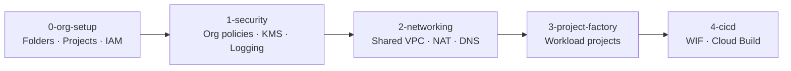

# GCP Landing Zone — Deployment Guide

LZA-style staged deployment using Terraform and YAML configuration.

## Prerequisites

| Requirement | Details |
|---|---|
| GCP Organization | With Cloud Identity or Workspace domain verified |
| Billing account | Linked to organization |
| Permissions | `roles/resourcemanager.organizationAdmin`, `roles/billing.admin` |
| Tools | `terraform >= 1.5`, `gcloud`, `git` |
| Bootstrap project | Create `proj-bootstrap` manually under Management folder |

## Configuration (like AWS LZA config files)

Edit YAML files in `configs/` before deploying:

| File | AWS LZA equivalent | Purpose |
|---|---|---|
| `global-config.yaml` | `global-config.yaml` | Org ID, billing, regions, labels |
| `folders-config.yaml` | OU structure in `organization-config.yaml` | Folder hierarchy |
| `projects-config.yaml` | `accounts-config.yaml` | Platform projects |
| `workloads-config.yaml` | Account vending / customizations | Workload projects |
| `security-config.yaml` | `security-config.yaml` | Org policies, KMS, log sinks |
| `network-config.yaml` | `network-config.yaml` | Shared VPC, NAT, DNS, firewall |
| `iam-config.yaml` | Identity Center mapping | Groups, custom roles, SAs |

### Minimum changes required

```yaml
# configs/global-config.yaml
organization:
  id: "YOUR_ORG_ID"
  domain: "yourcompany.com"
billing:
  account_id: "YOUR-BILLING-ACCOUNT-ID"
```

Update group emails in `configs/iam-config.yaml` and project IDs if your naming convention differs.

## Deployment stages



| Stage | Directory | Creates |
|---|---|---|
| 0 | `stages/0-org-setup/` | Folders, 16 platform projects, custom roles, SAs, state bucket |
| 1 | `stages/1-security/` | Org policies, KMS keys, log sinks, archive buckets |
| 2 | `stages/2-networking/` | Shared VPC, subnets, Cloud NAT, DNS, firewall rules |
| 3 | `stages/3-project-factory/` | Workload projects from `workloads-config.yaml` |
| 4 | `stages/4-cicd/` | Workload Identity Federation, Cloud Build triggers |

## First-time bootstrap

### Step 1 — Create bootstrap project manually

```bash
gcloud projects create proj-bootstrap --name="Bootstrap"
gcloud billing projects link proj-bootstrap --billing-account=YOUR-BILLING-ID
gcloud services enable cloudresourcemanager.googleapis.com storage.googleapis.com \
  --project=proj-bootstrap
```

### Step 2 — Configure

```bash
cp configs/global-config.yaml configs/global-config.yaml.bak
# Edit configs/*.yaml with your values
cp stages/0-org-setup/terraform.tfvars.example stages/0-org-setup/terraform.tfvars
```

### Step 3 — First run with local backend

```bash
cp stages/0-org-setup/backend.local.tf.example stages/0-org-setup/backend_override.tf
cd stages/0-org-setup
terraform init
terraform apply
```

### Step 4 — Migrate to GCS backend

```bash
rm backend_override.tf
terraform init -migrate-state   # confirm migration to gs://tf-state-gcp-landing-zone
cd ../..
```

### Step 5 — Deploy remaining stages

```bash
chmod +x scripts/bootstrap.sh
./scripts/bootstrap.sh all
```

Or stage by stage:

```bash
./scripts/bootstrap.sh 1-security
./scripts/bootstrap.sh 2-networking
./scripts/bootstrap.sh 3-project-factory
./scripts/bootstrap.sh 4-cicd
```

## Makefile shortcuts

```bash
make validate   # Validate all stages
make fmt        # Format Terraform
make plan       # Plan all stages
make apply      # Apply all stages
```

## Adding a workload project (Account Factory)

Add entry to `configs/workloads-config.yaml`:

```yaml
  - project_id: "proj-prod-app-b"
    name: "Prod App B"
    folder: "production"
    labels:
      environment: "prod"
      application: "app-b"
      owner: "team-b@example.com"
      cost-center: "CC-4002"
    apis:
      - container.googleapis.com
    shared_vpc:
      enabled: true
      host_project: "proj-net-hub"
      subnets:
        - "subnet-app-us-central1"
    iam_bindings:
      "roles/viewer":
        - "group:gcp-developers@example.com"
```

Then deploy:

```bash
./scripts/bootstrap.sh 3-project-factory
```

## Repository structure

```
GCP-LandingZone/
├── configs/                    # LZA-style YAML configuration
│   ├── global-config.yaml
│   ├── folders-config.yaml
│   ├── projects-config.yaml
│   ├── workloads-config.yaml
│   ├── security-config.yaml
│   ├── network-config.yaml
│   └── iam-config.yaml
├── stages/                     # Staged Terraform (like LZA pipeline stages)
│   ├── 0-org-setup/
│   ├── 1-security/
│   ├── 2-networking/
│   ├── 3-project-factory/
│   └── 4-cicd/
├── modules/                    # Reusable Terraform modules
│   ├── folder/
│   ├── project/
│   ├── org-policies/
│   ├── logging/
│   ├── shared-vpc/
│   ├── kms/
│   ├── iam/
│   ├── egress/
│   ├── dns/
│   ├── service-account/
│   └── workload-identity/
├── cloudbuild/                 # CI/CD pipeline definitions
├── scripts/bootstrap.sh        # Stage deployment script
├── Makefile
└── docs/
```

## CI/CD

Cloud Build triggers are created in stage 4. Connect your GitHub repo to `proj-cicd-shared` and update:

- `configs/iam-config.yaml` — WIF attribute condition for your repo
- `stages/4-cicd/main.tf` — `github_org` variable

## Troubleshooting

| Issue | Fix |
|---|---|
| State bucket doesn't exist | Use local backend for stage 0 first run |
| Org policy API error | Enable `orgpolicy.googleapis.com` on bootstrap project |
| Project ID taken | Change `project_id` in configs (globally unique) |
| Shared VPC attach fails | Ensure host project APIs enabled in stage 0 |
| Permission denied on folders | Verify org admin role for deploying identity |
