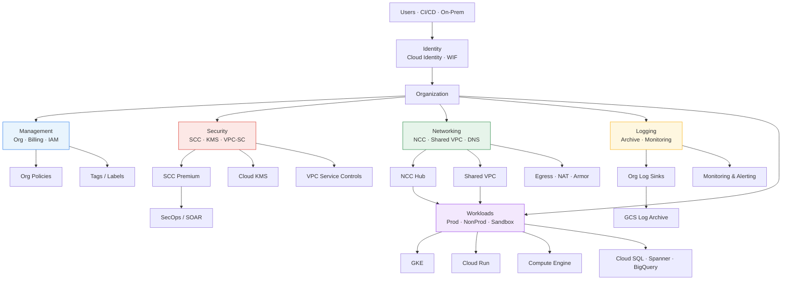
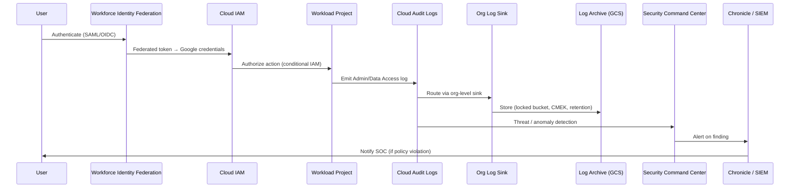
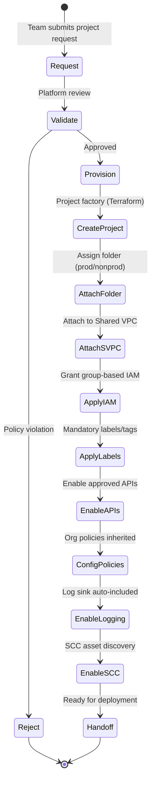
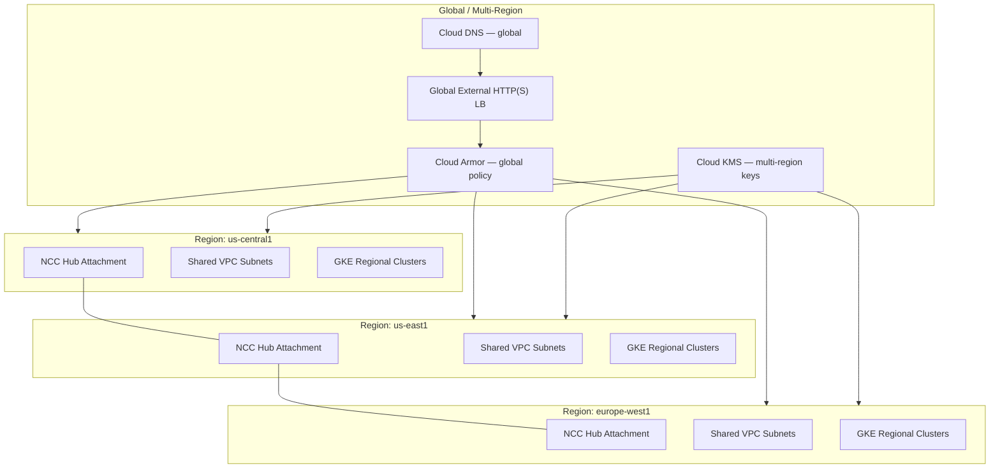

# GCP Landing Zone — Detailed Architecture

## End-to-End Platform View

---

## Data Flow — Security & Audit

---

## Workload Onboarding Flow

---

## Multi-Region Design

---

## Mandatory Resource Labels (Tag Policy Equivalent)

| Label Key | Example | Enforced By |
|---|---|---|
| `environment` | prod, stg, dev, sandbox | Org policy / Config Controller |
| `cost-center` | CC-1234 | Org policy |
| `application` | payments-api | Org policy |
| `owner` | team-platform@corp.com | Org policy |
| `data-classification` | confidential, internal, public | Org policy |
| `compliance` | pci, hipaa, none | Org policy |
| `managed-by` | terraform | Config Controller |
